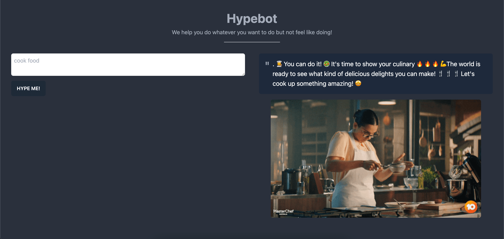

# Hypebot
Simple tool built with GPT3 to hype you up for whatever thing you want to do!



### Technologies

- [NextJS](https://nextjs.org) v12
- [Tailwind](https://tailwindcss.com) v3
- [TypeScript](https://typescriptlang.org) v4
- OpenAI GPT3
- Giphy API

---

## Getting Started

Install dependencies
````bash
yarn install
````

Run the development build
````bash
yarn dev
````

Run the production build
````bash
yarn build
yarn start
````

## Project Structure
```
project
|-- public                    ℹ️ keep your static resource files
|-- src
|   |-- common
|   |   |-- components
|   |   |   |-- elements      ℹ️ keep your state-less components
|   |   |   |                 ℹ️ keep your state-full components
|   |   |-- config            ℹ️ keep your configuration files
|   |   |-- hoc
|   |   |-- hooks
|   |   |-- layouts
|   |   |-- sections          ℹ️ keep your common sections
|   |   |-- types
|   |-- lib
|   |-- modules
|   |-- pages
|   |   |-- api               ℹ️ keep your pages here
|   |-- services
|   |-- styles
|   |-- utils
|   |   |-- constants         ℹ️ keep your constants
|   |   |                     ℹ️ keep your util functions
```

## Collaborators

- [Devesh Pawar](https://www.linkedin.com/in/devesh-pawar-60304113b/)
- [Mandy Stadtmiller](https://twitter.com/mandystadt)
- [Aditya Bhushan Dwivedi](https://twitter.com/adi_bhushan)
- [Dylan Sleith](https://twitter.com/dylansleith)
- [Tushar Darewar](https://twitter.com/TusharDarewar)